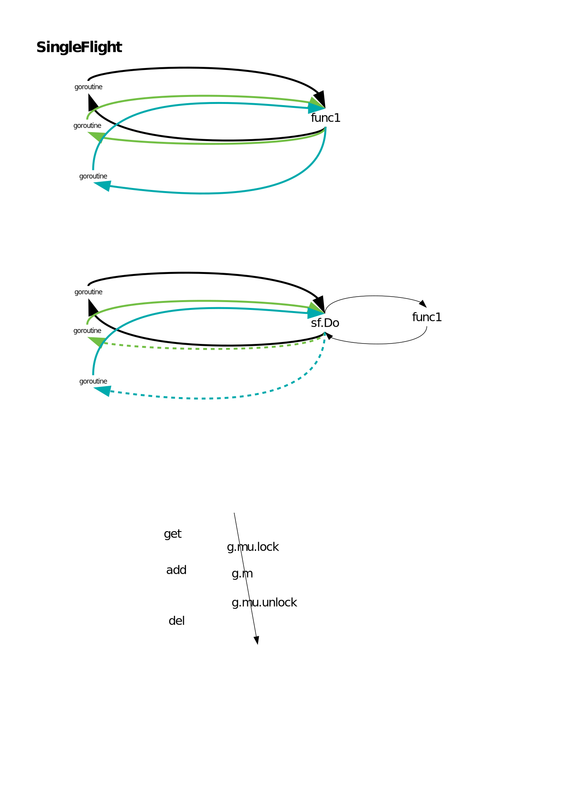

## GPM
### goroutine
- goroutine 泄漏及措施
```
死循环、channel 阻塞、锁等待，只要是会造成阻塞的写法都可能产生泄露
https://zhuanlan.zhihu.com/p/74090074
```

```
wg.Add(1)
go func(){
    ...
    wg.Done()
}()

wg.Wait()
```
```
mutex.Lock()
defer mutext.Unlock()
```

- scheduler

## CHANNEL

## GC
- 三色标记 concurrent mark-sweep，非分代，非紧缩，混合写屏障
```
/usr/lib/go1.16.3/src/runtime/mgc.go

黑白灰
root -> 灰
        灰 -> 灰
        黑 -> 灰
        ...
        灰=null
        回收白
```
- 平衡：程序吞吐量，gc吞吐量，stw时间，stw频率，压缩，分配性能，并发，伸缩，调优复杂度
- 并发收集器：垃圾回收的同时应用程序也在执行
- 并行收集器：垃圾回收采取多线程利用多个cpu一起进行gc
- 压缩：compact，将存活对象移动到一起，获得连续的空闲空间
- 1.8 hybrid write barrier,stw 到sub ms，混合式
- 写屏障，在写入指针前执行的一小段代码，用以防止并发标记时指针丢失，go在编译时加入。
```
a=nil,b=c
// scan a
a=c // c 加入buf,防止c丢失
// scan b
b = nil
// flush c from buf to 灰 // 没有buf，c丢失
```

## context

- context.WithCancel


## atomic
- store


## demo
[code](https://github.com/drcwr/godemos)


# go runtime 
## gpm调度模型 
```
g 应用逻辑 goroutine 协程 用户态
m 干活的   machine 对应一个内核线程，g在m上执行，默认最大限制为10000个
p 调度的   process 代表处理器 P的个数就是GOMAXPROCS（最大256），并发任务的数量，每一个运行的M都必须绑定一个P，每一个P保存着本地G任务队列；还有一个全局G任务队列，P/M需要进行绑定
```


```
调度流程

/usr/lib/go1.16.3/src/runtime/proc.go
// One round of scheduler: find a runnable goroutine and execute it.
// Never returns.
func schedule() {}

每次go调用的时候，都会：

1.     创建一个G对象，加入到本地队列或者全局队列 func newproc(siz int32, fn *funcval) {}
2.     如果还有空闲的P，则创建一个M
runtime.main 			newm(sysmon, nil, -1)
3.     M会启动一个底层线程，循环执行能找到的G任务

在M与P绑定后，M会不断从P的Local队列(runq)中取出G(无锁操作)，切换到G的堆栈并执行，当P的Local队列中没有G时，再从Global队列中返回一个G(有锁操作，因此实际还会从Global队列批量转移一批G到P Local队列)，当Global队列中也没有待运行的G时，则尝试从其它的P窃取(steal)部分G来执行
/usr/lib/go1.16.3/src/runtime/proc.go
func findrunnable() (gp *g, inheritTime bool) {}

```
- sysmon

#### gotoutine 状态
- gopark()
- goready()


```
/usr/lib/go1.16.3/src/runtime/asm_amd64.s
runtime·rt0_go

	CALL	runtime·args(SB)
	CALL	runtime·osinit(SB)
	CALL	runtime·schedinit(SB)

/usr/lib/go1.16.3/src/runtime/proc.go
// The new G calls runtime·main.
func schedinit() {}

```


## 并发原语
- singleflight



```
https://blog.csdn.net/caoPengFlying/article/details/115874559
https://segmentfault.com/a/1190000039712358?utm_source=tag-newest
https://pkg.go.dev/golang.org/x/sync/singleflight
```

## 内存空间结构
- tcmalloc span,go page=8kB,
### 两阶稀疏索引
- 在1.11 中
- 可以超过 512G 内存, 
- 也可以允许内存空间扩展时不连续.
 
 在全局的 mheap struct 中有个 arenas 二阶数组
 - slot ，4M 个。在 linux amd64 上,一阶只有一个 slot, 二阶有 4M 个 slot
 - heapArena ，64M 内存。每个 slot 指向一个 heapArena 结构, 每个 heapArena 结构可以管理 64M 内存
 - 256TB 内存。go 可以管理 4M*64M=256TB 内存, 即目前 64 位机器中 48bit 的寻址总线全部 256TB 内存


## 性能问题排查和优化
### 内存慢慢的OOM
- memory inuse_spaced 的pprof和list。全局对象或长生命周期对象
### 内存突增的OOM
- stack trace,排查
### 性能问题
- 火焰图，查看热点。gc频繁，编解码低效。

### 问题排错点
- 负载，内存，依赖服务
- panic
- cpu的pprof
- 日志，通过channel，发送给单独的goroutine异步打印
- GODEBUG-gctrace=1,查看GC的stw.gctrace输出到console，这是内存；或者 stdout重定向到文件。保持开启gc需要的锁，导致下一次gc无法获取锁，进入gc检查，导致p阻塞，实际上就造成两stw。


## 自举
```
c -> dist -> go_bootstrap -> go

```
- https://blog.csdn.net/byxiaoyuonly/article/details/112430074

## dlv debug
vscode
install dlv
go mod init
debug f5
gopath 路径打开代码

https://www.yht7.com/news/31963
https://code.visualstudio.com/docs/editor/variables-reference

参考
- https://blog.csdn.net/jinyidong/article/details/88235290
- https://www.cnblogs.com/lvpengbo/p/13973906.html
- https://blog.csdn.net/liangzhiyang/article/details/52669851
- https://zhuanlan.zhihu.com/p/95056679
- https://draveness.me/golang/
- https://talks.golang.org/
- http://www.topgoer.com/%E5%BC%80%E6%BA%90/go%E5%AD%A6%E4%B9%A0%E7%BA%BF%E8%B7%AF%E5%9B%BE.html

