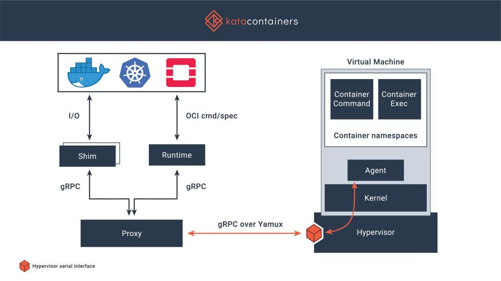
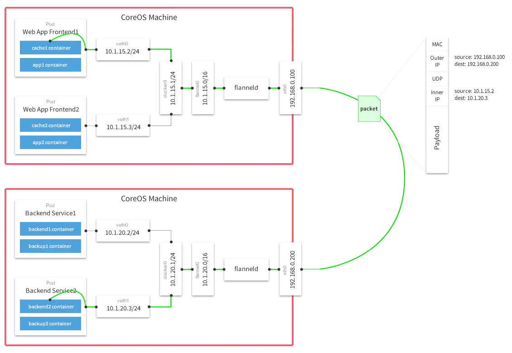

## kata



- [kafa.odg](files/31-kafa.odg)
- runtimeClassName

## operator
- [operator kubebuilder demo](operator.md)
- [how](operator-how.md)

## scheduler
[source](files/01-k8s-scheduler.odg)

## flannel


## ubuntu16.04-kubeadm-k8s-all-in-one
[ubuntu16.04-kubeadm-k8s-all-in-one](ubuntu16.04-kubeadm-k8s-all-in-one.md)


## debug src
```
[install go](updateGolangOnUbuntu.md)

mkdir -p /opt/gopath/src/k8s.io
cd /opt/gopath/src/k8s.io
git clone https://github.com/kubernetes/kubernetes.git

or
git clone https://github.com/kubernetes/kubernetes.git k8s.io/kubernetes


or
go get -d k8s.io/kubernetes

cd kubernets

make
or
make WHAT=cmd/kube-scheduler
or 
cd cmd/kube-scheduler
go build

cat Dockerfile
FROM busybox
ADD kube-scheduler /usr/local/bin/kube-scheduler

cat build-docker
cp /opt/gopath/src/k8s.io/kubernetes/_output/local/bin/linux/amd64/kube-scheduler .
docker build -t cwr-kube-scheduler:21 .

vim /etc/kubernetes/manifests/kube-scheduler.yaml
image: cwr-kube-scheduler:21

```